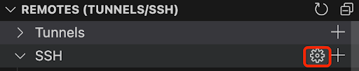
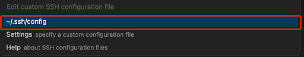
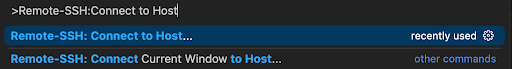
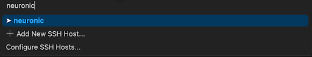
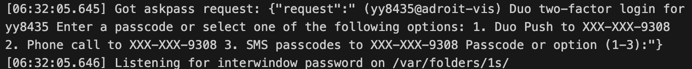
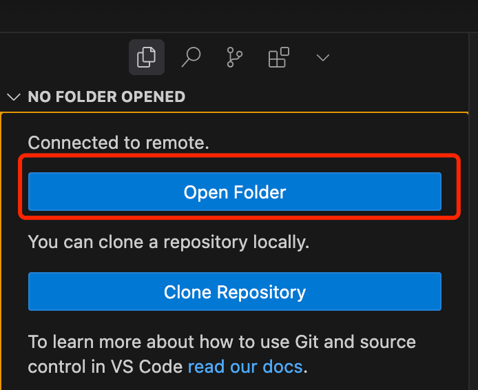
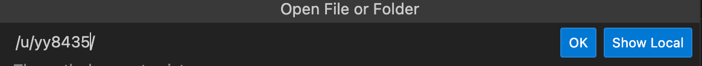

# Neuronic Cluster

**Contact:** If you have any questions regarding the setup or usage of the Neuronic cluster, please contact [David Yin](https://davidyyd.github.io) via [email](yida.yin@princeton.edu) or through [Messenger](https://www.facebook.com/yida.yin.5?mibextid=wwXIfr&mibextid=wwXIfr). Please make sure to send me a message on Messenger first before sending a friend request on Facebook.

## Overview

This manual is a guide for using the Neuronic cluster in Zhuang's group at Princeton University.

Neuronic is a SLURM cluster funded by the Dean for Research and the School of Engineering and Applied Science (SEAS), for members of SEAS who need a high performance computing (HPC) cluster environment and GPUs, to perform their research. The Neuronic cluster is composed of 33 identical nodes (each with 8 L40 GPUs).

## Table of Contents

- [Neuronic Cluster Manual](#neuronic-manual)
  - [Overview](#overview)
  - [Table of Contents](#table-of-contents)
  - [Getting Started](#getting-started)
  - [Quick Launch](#quick-launch)
  - [Connect to the Cluster](#connect-to-the-cluster)
    - [Configure SSH](#configure-ssh)
    - [Connect to Neuronic](#connect-to-neuronic)
  - [How to Use](#how-to-use)
  - [Hardware Configuration](#hardware-configuration)
  - [Compute Node](#compute-node)
    - [SLURM](#slurm)
    - [Submit the Job](#submit-the-job)
    - [Interactive Session](#interactive-session)
  - [Neuronic SLURM Queue](#neuronic-slurm-queue)
    - [Age](#age)
    - [Fairshare](#fairshare)
    - [JobSize](#jobsize)
    - [Partition](#partition)
  - [Storage](#storage)
  - [Useful Commands](#useful-commands)
    - [Status of jobs](#status-of-jobs)
    - [Cancel a job](#cancel-a-job)
    - [Status of all the nodes in the cluster](#status-of-all-the-nodes-in-the-cluster)
    - [Current GPU status and utilization in the cluster](#current-gpu-status-and-utilization-in-the-cluster)
    - [CPU and GPU hours](#cpu-and-gpu-hours)
    - [Priority of your account](#priority-of-your-account)
  - [Frequently Asked Questions](#frequently-asked-questions)
  - [Links](#links)
  - [Comments and Contact](#comments-and-contact)
  - [Acknowledgements](#acknowledgements)

## Getting Started
To connect to Neuronic, you should have either a Princeton account or a Research Computer User (RCU) account (for external collaborators). 

If you have not been approved of access to Neuronic and yet your research requires access, please contact Zhuang for help.

## Quick Launch

First, you need to connect to the cluster. See the [Connect to the Cluster](#connect-to-the-cluster) section for detailed instructions.

Below we show a simple example of submitting a SLURM job to train a neural network on the MNIST dataset using PyTorch Distributed Data Parallel (DDP).
We first clone this repo and create a conda environment called `torch-env` to install relevant packages.

```bash
git clone https://github.com/davidyyd/Neuronic-Manual.git
module purge
module load anaconda3/2024.02
source ~/.bashrc
conda create -n torch-env python=3.12
conda activate torch-env
pip install torch torchvision --index-url https://download.pytorch.org/whl/cu118
```

Download the MNIST dataset. 

```bash
python download_data.py
```

Finally, use the `sbatch` command to submit the job:
```bash
sbatch job.slurm
```

You can check the log file `my_first_job.out` in the directory where you ran the command. The model should achieve 98% accuracy on the test set in two epochs.

For more details on the above SLURM script, check out [here](https://github.com/PrincetonUniversity/multi_gpu_training/tree/main/02_pytorch_ddp)


## Connect to the Cluster

Once you have been granted access to Neuronic, you can connect Neuronic using an SSH client. 

**Note:** Your account should be configured with two-factor authentication before you can connect to the cluster. Follow [this link](https://princeton.edu/duoportal) to set up two-factor authentication. It is also recommended to connect to the campus network when accessing the cluster. If you are off campus, use GlobalProtect VPN to connect to the campus network. See the detailed instructions [here](https://princeton.service-now.com/service?sys_id=KB0012373&id=kb_article) to set up this. This is not needed when the computer has been directly connected to the campus wifi (eduroam). 

### Configure SSH
We recommend using the remote explorer in Cursor / VSCode to establish an SSH connection with the cluster. For Cursor, you can claim a free membership [here](https://www.cursor.com/pricing). Open the SSH configuration under the remote explorer.

<p align="center">

</p>
<p align="center">

</p>

Copy and paste the following into the SSH configuration. Replace `<YourNetID>` with the username for the account (everything before @). For example, if your account is `yy8435@princeton.edu`, then `<YourNetID>` should be `yy8435`.  

```
Host neuronic
    HostName neuronic.cs.princeton.edu
    User <YourNetID>
```


### Connect to Neuronic

Open the Command Palette with `Ctrl+Shift+P` (or `Cmd+Shift+P` on Mac). Type `>Remote-SSH: Connect to Host` and press Enter. 
<p align="center">

</p>

Then type `neuronic` in the Command Palette and press Enter.

<p align="center">

</p>

It will ask you to type in the password for the account. You can check out [here](https://github.com/PrincetonUniversity/removing_tedium/tree/master/02_passwordless_logins) and see how to avoid typing in the password every time.
<p align="center">

</p>

Then complete the two-factor authentication step.
<p align="center">

</p>

Check the SSH connection output to select the two-factor login method. Here 1 is for Duo Push, 2 is for Phone Call, and 3 is for SMS Passcode.
<p align="center">

</p>

Finally click the Open Folder button.

<p align="center">

</p>

It will automatically set the path to the home directory, which should be `/u/<YourNetID>`.

<p align="center">

</p>

## How to Use

Since Neuronic is a Linux system, knowing basic Linux commands is very important. For an introduction to Linux navigation, see the [Intro to Linux Command Line workshop](https://github.com/gabeclass/introcmdline) materials.

After logging in, you will land on a login node. The login node is only for lightweight tasks like file management, code editing, and job submission. For computational work, you must use compute nodes (see [Compute Node](#compute-node) section). Running computationally heavy tasks on the login node will block the normal traffic to it so that other users cannot connect to the cluster.


## Hardware Configuration

Each Neuronic cluster node is a Lenovo ThinkSystem SR670 V2 containing:

- 2 x Intel Xeon Gold 5320 26-core CPUs (104 cores total)
- 16 x 32 GB DDR4 3200MHz RDIMMs (512 GB total)
- 8 x NVIDIA L40 GPUs (46 GB memory each)
- 3.5TB of SSD for local scratch
- One 10Gbps Ethernet uplink (Note: NOT Infiniband)

## Compute Node

This section explains how to submit jobs to compute nodes on Neuronic, especially for GPU workloads. All computational work must be performed on compute nodes, not login nodes, and jobs are managed using the SLURM scheduler.

### SLURM

SLURM (Simple Linux Utility for Resource Management) is the job scheduler used on Neuronic. It manages resource allocation and job scheduling for all users.

**Useful SLURM commands** (type these in the terminal to check cluster and job status)
```bash
sinfo                    # Show all partition and node information
sinfo -N -p <Partition>  # Show node status of a given partition
squeue                   # Show running and pending jobs
squeue --me              # Show only your jobs
scontrol show job <JobID>  # Show detailed job information
scancel <JobID>            # Cancel a job
sacct -j <JobID>           # Show job accounting information
```

**A typical SLURM batch script should specify:**
- `#SBATCH --job-name=...`         # Name for your job
- `#SBATCH --nodes=...`            # Number of nodes to allocate
- `#SBATCH --ntasks=...`           # Number of tasks (processes)
- `#SBATCH --gres=gpu:...`         # Number of GPUs per node
- `#SBATCH --cpus-per-task=...`    # Number of CPU cores per task
- `#SBATCH --mem=...`              # Memory per node (e.g., 16G)
- `#SBATCH --time=...`             # Time limit (hh:mm:ss)
- `#SBATCH --output=...`           # Output file for logs
- The commands to run your job (e.g., `python my_script.py`)

**Example (minimal):**
```bash
#!/bin/bash
#SBATCH --job-name=test_job        # Job name
#SBATCH --nodes=1                  # Number of nodes
#SBATCH --ntasks=1                 # Number of tasks
#SBATCH --gres=gpu:4               # Number of GPUs per node
#SBATCH --cpus-per-task=4          # CPU cores per task
#SBATCH --mem=16G                  # Memory per node
#SBATCH --time=01:00:00            # Time limit (1 hour)
#SBATCH --output=output_%j.log     # Output file (%j = job ID)

python my_script.py                # Your job command
```
### Submit the Job

Check out the [Quick Launch](#quick-launch) section for a simple example of submitting a SLURM job to train a neural network on the MNIST dataset using PyTorch Distributed Data Parallel (DDP).

### Interactive Session

Interactive sessions are useful for example to test code, run short scripts, or debug interactively. To start an interactive session on a GPU node, use:

```bash
salloc --nodes=1 --ntasks=1 --time=60:00 --cpus-per-task=8 --mem=32G --gres=gpu:4
```

Once the session is granted, you will be logged into a compute node with GPU access with an interactive shell. You can run a Python script directly without `sbatch` command (e.g., our MNIST classification example):
```bash
module purge
module load anaconda3/2024.02
conda activate torch-env
python -m torch.distributed.run --nproc_per_node=4 mnist_classify_ddp.py --epochs 2
``` 

To exit the interactive session, simply type:

```bash
exit
```

## Neuronic SLURM Queue

On Neuronic, the **priority** of your job only matters when there’s competition. If a job is eligible and there are free nodes that match requested constraints, it should start immediately regardless of the priority.

Specifically, a jobs’s priority score is calculated as:

$$
\begin{aligned}
\text{PRIORITY} &= W_A A + W_F F + W_J J + W_P P \\
                &= 500(\text{Age}) + 10000(\text{Fairshare}) + 500(\text{JobSize}) + 500(\text{Partition})
\end{aligned}
$$

The higher the priority of a job is, the earlier it is in the queue.

<details>
  <summary><code>sprio -w</code> — show priority weights</summary>

  <pre><code>$ sprio -w
JOBID PARTITION PRIORITY SITE AGE FAIRSHARE JOBSIZE PARTITION Weights
                            1 500     10000     500       500
</code></pre>
</details>


###  Age

**Definition:** How long your job has been eligible to run (i.e., ready to start, just waiting for resources). It grows linearly while the job is pending and eligible. 

**Normalization:** SLURM caps/normalizes Age by PriorityMaxAge (12 hours on Neuronic); once a job’s age ≥ that cap, its Age factor = 1.0(maxed). 


$$
\text{Age}=\min\left(\frac{\text{now}-\text{EligibleTime}}{\text{PriorityMaxAge}},1\right)
$$

<details>
  <summary>Show SLURM config values for <code>PriorityMaxAge</code> & <code>PriorityWeightAge</code></summary>

  <pre><code>$ scontrol show config | egrep '^PriorityMaxAge|^PriorityWeightAge'
PriorityMaxAge     = 12:00:00
PriorityWeightAge  = 500
</code></pre>
</details>


### Fairshare

**Definition:** A 0–1 score SLURM computes for the user@account association your job is charged to. 
Higher = you’ve used less than your entitled share recently.

How it’s computed (conceptually):
- SLURM maintains effective usage that decays exponentially with the cluster’s half-life (PriorityDecayHalfLife; on Neuronic it’s 14 days).
- Usage is tracked per TRES minutes (e.g., GPU-minutes, CPU-minutes).
- The scheduler turns that into a FairShare factor ∈ [0,1] for your user@account. That single scalar is what goes into the priority math.

<details>
  <summary>Show SLURM Fairshare settings: <code>PriorityDecayHalfLife</code>, <code>PriorityUsageResetPeriod</code>, <code>PriorityWeightFairShare</code></summary>

  <pre><code>$ scontrol show config | egrep '^PriorityDecayHalfLife|^PriorityWeightFairShare|^PriorityUsageResetPeriod'
PriorityDecayHalfLife   = 14-00:00:00
PriorityUsageResetPeriod= NONE
PriorityWeightFairShare = 10000
</code></pre>
</details>

Each user has its own fairshare, which is affected by the following factors:

- **NormShares:** Your entitled share value (uniformly distributed across all users in Neuronic).
- **EffectvUsage:** Your recent, decay-weighted share of actual usage.

From there, the **LevelFS = NormShares / EffectvUsage** is computed — **SLURM ranks by this.**

- `>1` means under-using (good),
- `~1` on-share,
- `<1` over-using (bad).


$$
\mathrm{LevelFS}
=\frac{\mathrm{NormShares}}{\mathrm{EffectvUsage}}
$$

SLURM orders accounts by **LevelFS**, and maps that ordering (fairtree algorithm) to a **FairShare** ∈ [0,1] per **user@account**. That final scalar is what your job uses as **FF** in the priority sum.

<details>
  <summary>Show Fair-Tree metrics for account <code>seas</code>  </summary>

  <pre><code>$ sshare -l yy8435 | awk 'NR&lt;20{print}'
Account                    User  RawShares  NormShares    RawUsage   NormUsage  EffectvUsage  FairShare    LevelFS
-------------------- ---------- ---------- ----------- ----------- ----------- ------------- ---------- ----------
root                                          0.000000 6181868410096                  1.000000
 seas                                    1    0.500000 6181868410096    1.000000      1.000000              0.500000
  seas                   yy8435          1    0.004831  1316226032    0.000213      0.000213   0.269231  22.689187
</code></pre>
</details>  

<br>

**Important:** On Neuronic, not fully using your requested resources can also affect your fairshare, this includes CPU cores, RAM, GPU Utilization, GPU VRAM. A useful command is `jobstats <JobID>`. This command should be ran often to monitor your resource usage for a specific job. You can also ssh into a specific compute node from the login node when your job is running to check the resource usage. 


### JobSize

**Definition:** An integer factor that increases with how **big** your job request is. On Neuronic, bigger job ⇒ bigger **J** because `PriorityFavorSmall=no`.

- The **size of request in CPUs** determines it. On Neuronic it’s effectively **CPUs requested** (GPUs don’t count here).
- Each CPU counts ~0.078 jobsize (with a constant offset of 8). That is:
  - 1 CPU = 8 jobsize
  - 52 CPUs = 12 jobsize
  - 104 CPUs = 16 jobsize

<details>
  <summary>Show the JobSize component for an example job</summary>

  <pre><code>$ sprio -l -j 66690591
  JOBID PARTITION     USER  ACCOUNT   PRIORITY       SITE        AGE      ASSOC  FAIRSHARE    JOBSIZE  PARTITION
2264734 all         mc5063     seas        290          0        180          0         48         13         50                    
</code></pre>
</details>

### Partition

**Definition:** The type of partition your job is submitted to.

There are two kinds of partitions (both supported on each node): `all` and `interactive`. `all` has a priority job factor of 100, while `interactive` has a priority factor of 1000.

The partition value is computed as follows:

$$
\text{Partition}=\frac{\text{PriorityJobFactor(partition)}}{1000}
$$

This essentially prioritizes an interactive job (with priority 1000) over other normally submitted jobs (in the `all` partition). 

<details>
  <summary>Show SLURM config values for <code>PriorityJobFactor</code> & <code>PriorityTier</code></summary>

  <pre><code>$ scontrol show partition all | egrep -i 'PartitionName|PriorityTier'
PartitionName=all
   PriorityJobFactor=100 PriorityTier=100 RootOnly=NO ReqResv=NO OverSubscribe=NO
</code></pre>
</details>


In general, waiting time, job usage, and past usage together determine whether your job can start.


## Storage Space

There are three types of storage space on the cluster:

- Home space (`/u/<YourNetID>` or `~`): 
  This is the home directory for each user. Since there is only a limit of 16 GB, it should be used to store code only.
- Project space (`/n/fs/vision-mix/<YourNetID>`): 
  This is the shared project directory for each user in our lab. It has a total limit of 26 TB across all users. You can use it to store your conda environment, model checkpoints, and other large files. Please be considerate with your usage, as this space is shared by everyone. Each user’s directory needs to be created manually. To request a new one, please contact David Yin by [email](yida.yin@princeton.edu) or [messenger](https://www.facebook.com/yida.yin.5?mibextid=wwXIfr&mibextid=wwXIfr) for help.
- Scratch space (`/scratch/<YourNetID>`): 
  This is the shared scratch directory on each node (i.e., not accessible from other nodes). It has a limit of 3.5TB across all users. You can use it to store any temporary files, such as pip install cache and huggingface cache. Note that this space is not backed up and routinely purged, so you should not store any important files here.

## Useful Commands

Here we list some useful commands for managing your job submissions and account usage.

### Status of jobs

`squeue` shows the status of all your submitted jobs. You can check the status of your own jobs by:
```bash
squeue -u <YourNetID>
```

It will print out the status of all your submitted jobs, including the job ID, partition, name, user, status, time, number of nodes, and node list:
```bash
  JOBID PARTITION           NAME     USER ST       TIME  NODES NODELIST(REASON)
2251339       all classification   yy8435  R 1-04:11:33      4 (Priority)
2251237       all           gpt2   yy8435  R 1-04:11:33      2 neu[329-330]
```

It is also possible to check the status of all jobs in the cluster by removing the `-u <YourNetID>` option:
```bash
squeue
```

### Cancel a job
`scancel` is used to cancel a job in the cluster. You can cancel a job by its job ID:
```bash
scancel <JobID>
```
It is also possible to cancel all your jobs at once by specifying your NetID:
```bash
scancel -u <YourNetID>
```


### Status of all the nodes in the cluster

To see the current status of all the nodes in the cluster, we build a helper script `check_all_nodes.sh` (in the root directory of this repo):

```bash
bash check_all_nodes.sh
```

It will print out the number of free CPUs, CPU memory usage, and the number of free GPUs for each of 32 nodes in Neuronic. You can use this command to determine the best resources for your jobs.

```bash
neu301     FreeCPUs= 40/104   FreeMem=375.0GiB/503.0GiB   FreeGPUs=1/8
...
neu332     FreeCPUs=  4/104   FreeCPUMem= 23.0GiB/503.0GiB   FreeGPUs=4/8
```

### Current GPU status and utilization in the cluster

`gpudash` is a tool to check the GPU status across all nodes. 
```bash
gpudash
```
It will print out the GPU utilization for each GPU in the cluster during the last hour:
```bash
                                    NEURONIC-GPU UTILIZATION (Mon Jul 28)

            3:10 AM       3:20 AM       3:30 AM       3:40 AM       3:50 AM       4:00 AM       4:10 AM
neu301 0   yy8435:100    yy8435:99     yy8435:100    yy8435:100    yy8435:98     yy8435:100    yy8435:100
       1   yy8435:100    yy8435:100    yy8435:100    yy8435:100    yy8435:100    yy8435:99     yy8435:100
       2   yy8435:100    yy8435:100    yy8435:100    yy8435:100    yy8435:98     yy8435:100    yy8435:100
       3   yy8435:100    yy8435:100    yy8435:100    yy8435:100    yy8435:100    yy8435:100    yy8435:100
       4   yy8435:100    yy8435:100    yy8435:100    yy8435:100    yy8435:100    yy8435:100    yy8435:100
       5   yy8435:100    yy8435:100    yy8435:100    yy8435:100    yy8435:99     yy8435:100    yy8435:100
       6   yy8435:99     yy8435:100    yy8435:100    yy8435:100    yy8435:100    yy8435:100    yy8435:100
       7   yy8435:99     yy8435:100    yy8435:100    yy8435:100    yy8435:99     yy8435:100    yy8435:100
...
neu332 0   yy8435:100    yy8435:99     yy8435:100    yy8435:100    yy8435:98     yy8435:100    yy8435:100
       1   yy8435:100    yy8435:100    yy8435:100    yy8435:100    yy8435:100    yy8435:99     yy8435:100
       2   yy8435:100    yy8435:100    yy8435:100    yy8435:100    yy8435:98     yy8435:100    yy8435:100
       3   yy8435:100    yy8435:100    yy8435:100    yy8435:100    yy8435:100    yy8435:100    yy8435:100
       4   yy8435:100    yy8435:100    yy8435:100    yy8435:100    yy8435:100    yy8435:100    yy8435:100
       5   yy8435:100    yy8435:100    yy8435:100    yy8435:100    yy8435:99     yy8435:100    yy8435:100
       6   yy8435:99     yy8435:100    yy8435:100    yy8435:100    yy8435:100    yy8435:100    yy8435:100
       7   yy8435:99     yy8435:100    yy8435:100    yy8435:100    yy8435:99     yy8435:100    yy8435:100
            3:10 AM       3:20 AM       3:30 AM       3:40 AM       3:50 AM       4:00 AM       4:10 AM
```

### CPU and GPU hours

`sreport` reports the CPU and GPU hours of your account. You need to specify the start and end date (in the format YYYY-MM-DD) for the report.
```bash
sreport -t Hours -T CPU,gres/gpu cluster AccountUtilizationByUser Users=<YourNetID> Start=<StartDate> End=<EndDate>
```
It will print out the report as follows:
```bash
Usage reported in TRES Hours
--------------------------------------------------------------------------------
  Cluster         Account     Login     Proper Name      TRES Name     Used
--------- --------------- --------- --------------- -------------- --------
 neuronic            seas    yy8435        Yida Yin            cpu     8722
 neuronic            seas    yy8435        Yida Yin       gres/gpu     1034
```

### Priority of your account

`sshare` gives the priority of your account.
```bash
sshare -u <YourNetID>
```
It will print out something like this:
```bash
Account                    User  RawShares  NormShares    RawUsage  EffectvUsage  FairShare
-------------------- ---------- ---------- ----------- ----------- ------------- ----------
root                                          0.000000 6744067132527      1.000000
 seas                                    1    0.500000 6744067132527      1.000000
  seas                   yy8435          1    0.004762 37444021933      0.005552   0.109005
```

Only the last row is related to your account. These values are less informative than those provided by `sreport`. For more information on each component of the priority, please check out [Neuronic SLURM Queue](#neuronic-slurm-queue).

## Frequently Asked Questions

<details>
<summary><strong>It takes a long time to queue a single-node job with 8 GPUs? What should I do?</strong></summary>

It is generally faster to queue a job with two nodes, each with 4 GPUs, than one node with 8 GPUs. The performance difference between these two options is minimal. You might also find our helper script `check_all_nodes.sh` useful to check the current status of all the nodes in the cluster and determine the best resources for your job.

</details>

<details>
<summary><strong>Why is my job's logging very slow and I have to wait for a long time to get the output?</strong></summary>

On Neuronic, the logging is not real time by default and is flushed by a fixed time interval. You can add `export PYTHONUNBUFFERED=1` to your job script to enable real time logging. It is also possible to use `flush=True` in `print` statements. But you should be careful with this if your job will print thousands of times per second.

</details>

<details>
<summary><strong>Can I download datasets to the cluster?</strong></summary>

Yes, it is generally fine to download datasets to the cluster (such as ImageNet, COCO, from Huggingface, etc.). But please monitor the storage space while you are downloading. Also, do not perform any web scraping (send thousands of requests to different websites at the same time). This might overwhelm the network and crash the cluster's DNS server.

</details>

<details>
<summary><strong>How to install packages that require compiling or intensive computation (e.g., FlashAttention) on the cluster?</strong></summary>

You should not install those packages on the login node. Instead, it is better to request a compute node and install the packages there. Otherwise, you might block the normal traffic to the login node so that other users cannot connect to the cluster.

</details>


## Links
Official websites:
- Neuronic Website: https://clusters.cs.princeton.edu

Taiming's guide on Della cluster:
- https://github.com/TaiMingLu/Della-Manual

More Resources:
- SLURM: https://researchcomputing.princeton.edu/support/knowledge-base/slurm
- PyTorch: https://researchcomputing.princeton.edu/support/knowledge-base/pytorch
- Huggingface: https://researchcomputing.princeton.edu/support/knowledge-base/hugging-face
- VSCode: https://researchcomputing.princeton.edu/support/knowledge-base/vs-code
- Sharing Data: https://researchcomputing.princeton.edu/support/knowledge-base/sharing-data

## Comments and Contact
**Resource Allocation Guidelines:** Please request the maximum CPU and GPU resources that your workload can effectively utilize. If your application cannot fully utilize the requested resources, consider requesting a lower configuration (e.g., smaller VRAM GPU, fewer CPU cores, or less memory). Jobs that underutilize their allocated resources may receive lower priority in the queue.

**Contacts:** 
For any questions regarding the setup or usage of the Neuronic cluster, please contact [David Yin](https://davidyyd.github.io) via [email](yida.yin@princeton.edu) or through [Messenger](https://www.facebook.com/yida.yin.5?mibextid=wwXIfr&mibextid=wwXIfr). Please make sure to send me a message on Messenger first (before sending a friend request on Facebook) in case I didn't see your friend request.

If you encounter any system issues on Neuronic, you can also contact [neuronic-help@cs.princeton.edu](neuronic-help@cs.princeton.edu) for help. However, please first check with me if we have encountered the same issue before.

## Acknowledgements
The section on the SLURM queue is adapted from Taiming Lu's [guide](https://github.com/TaiMingLu/Della-Manual) on Della cluster. The classification example is borrowed from [here](https://github.com/PrincetonUniversity/multi_gpu_training). Their repository includes more examples on using PyTorch Lightning, FSDP, and TensorFlow on the cluster. 